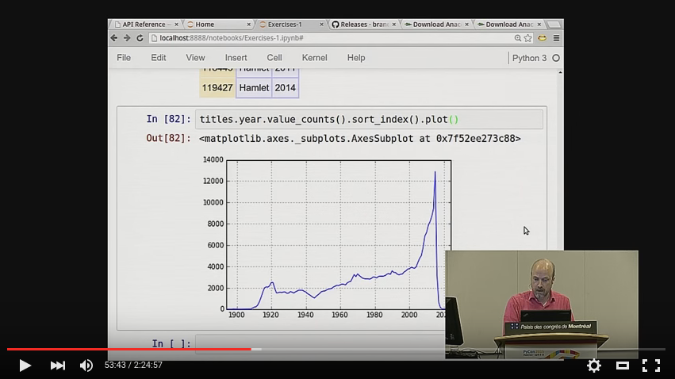

# Welcome to Brandon’s Pandas Tutorial

The first instance of this tutorial was delivered at PyCon 2015 in
Montréal, but I hope that many other people will be able to benefit from
it over the next few years — both on occasions on which I myself get to
deliver it, and also when other instructors are able to do so.

If you want to follow along with the tutorial at home, here is the
YouTube recording of the 3-hour tutorial at PyCon itself:

https://www.youtube.com/watch?v=5JnMutdy6Fw

To make it useful to as many people as possible, I hereby release it
under the MIT license (see the accompanying `LICENSE.txt` file) and I
have tried to make sure that this repository contains all of the scripts
needed to download and set up the data set that we used.

## Quick Start

If you have both `conda` and `git` on your system (otherwise, read the
next section for more detailed instructions):

    $ conda install --yes jupyter matplotlib pandas
    $ git clone https://github.com/brandon-rhodes/pycon-pandas-tutorial.git
    $ cd pycon-pandas-tutorial
    $ build/BUILD.sh
    $ jupyter notebook

## Detailed Instructions

You will need Pandas, the IPython Notebook, and Matplotlib installed
before you can successfully run the tutorial notebooks.  The [Anaconda
Distribution](https://www.anaconda.com/download/) is a great way to get up
and running quickly without having to install them each separately —
running the `conda` command shown above will install all three.

Note that having `git` is not necessary for getting the materials.
Simply click the “Download ZIP” button over on the right-hand side of
this repository’s front page at the following link, and its files will
be delivered to you as a ZIP archive:

https://github.com/brandon-rhodes/pycon-pandas-tutorial

Once you have unpacked the ZIP file, download the following four
[IMDB](https://www.imdb.com/) data files and place them in the
tutorial’s `build` directory:

* ftp://ftp.fu-berlin.de/misc/movies/database/frozendata/actors.list.gz
* ftp://ftp.fu-berlin.de/misc/movies/database/frozendata/actresses.list.gz
* ftp://ftp.fu-berlin.de/misc/movies/database/frozendata/genres.list.gz
* ftp://ftp.fu-berlin.de/misc/movies/database/frozendata/release-dates.list.gz

If the above links don’t work for you, try these alternate sources of the same files:

* ftp://ftp.funet.fi/pub/mirrors/ftp.imdb.com/pub/frozendata/actors.list.gz
* ftp://ftp.funet.fi/pub/mirrors/ftp.imdb.com/pub/frozendata/actresses.list.gz
* ftp://ftp.funet.fi/pub/mirrors/ftp.imdb.com/pub/frozendata/genres.list.gz
* ftp://ftp.funet.fi/pub/mirrors/ftp.imdb.com/pub/frozendata/release-dates.list.gz

To convert these into the CSV files that the tutorial needs, run the
`BUILD.py` script with either Python 2 or Python 3.  It will create the
three CSV files in the `data` directory that you need to run all of the
tutorial examples.  It should take about 5 minutes to run on a fast
modern machine:

    $ python build/BUILD.py

You can then start up the IPython Notebook and start looking at the
notebooks:

    $ ipython notebook

I hope that the recording and the exercises in this repository prove
useful if you are interested in learning more about Python and its data
analysis capabilities!

— [Brandon Rhodes](http://rhodesmill.org/brandon/)
